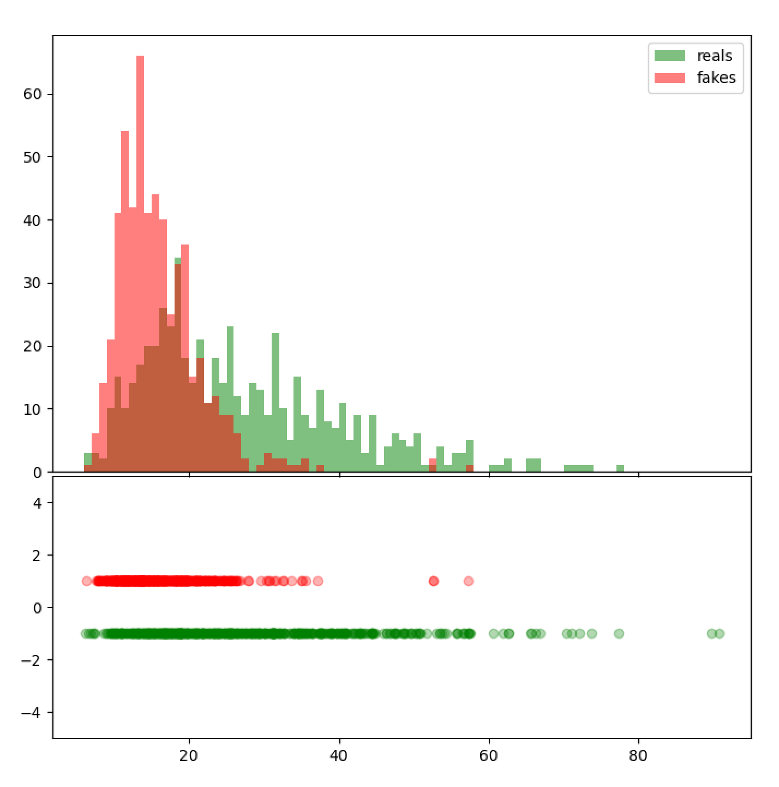

## How to run
To calculate the preplexities and visualize them, run the following commands
```
python calculate_perplexity.py
python visualize_perplexity.py
```
You can pass your own arguments to assess different datasets and models; review [`calculate_prepleexity.py`](calculate_perplexity.py) for details.

## Example
Running the commands above yields a graph like

